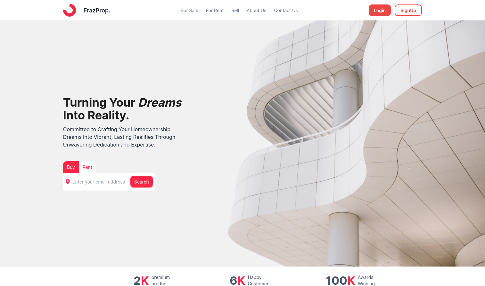

<hr />

# frazProp - Aquarium Landing Page

🏡 Welcome to FrazProp – Your Premier Hub for Real Estate Excellence! Explore the pinnacle of property discovery as we present FrazProp, your ultimate destination for buying, selling, and renting exquisite apartments and houses.

🌟 Immerse yourself in a curated selection of top-tier listings that redefine luxury living. FrazProp brings you an unparalleled real estate experience, seamlessly blending sophistication with cutting-edge technology.

🚀 Our platform is meticulously crafted using the latest technologies – React, TypeScript, Vite, React Router, Framer Motion, and Hero Icons – ensuring a sleek and intuitive journey through the world of real estate. 

Discover your dream home with FrazProp – where every listing is a masterpiece, and your journey to extraordinary living begins!


## Features

- **Immersive Design**: Crafted with care, frazProp offers an immersive design that captivates aquarium enthusiasts.

- **Fast Development**: Powered by Vite and TypeScript, enjoy a swift and efficient development experience.

- **Engaging Animations**: Framer Motion brings smooth and engaging animations to enhance the user experience.

## Getting Started

Follow these steps to explore frazProp on your local machine:

```bash
# Clone the Repository:
git clone https://github.com/your-username/aquarium-landing-page.git

# Navigate to the Project Directory:
cd aquarium-landing-page/aquarium

# Install Dependencies:
npm install

# Run the Development Server:
npm run dev

Open http://localhost:3000 in your browser to explore frazProp.
Exploring frazProp

Navigating the Landing Page:

    The landing page consists of multiple sections showcasing different aquariums.
    Use the navigation menu to jump to specific sections.

Interactive Elements:

    Explore interactive elements on the page, such as buttons and links, to discover more content.

Viewing Aquariums:

    Click on an aquarium to view detailed information.
    Enjoy smooth transitions and animations powered by Framer Motion.

Customizing Your Experience

Changing Themes:

    frazProp supports theme customization. Look for the theme options in the settings.

Personalizing Preferences:

    Customize your experience by adjusting preferences in the user settings.

Troubleshooting

    If you encounter any issues, refer to the Troubleshooting section in this guide or check the project's GitHub repository for help.

Contributing

    Interested in contributing to frazProp? Follow the Contribution Guidelines in the project repository.

Feedback

    We value your feedback! If you have suggestions or encounter issues, please open an issue on GitHub.

Enjoy exploring frazProp - your gateway to the fascinating world of aquariums!

server setup :

```bash
$ cd server
$ npm install
$ npx nodemon
```


This will render as:
```bash
$ cd server
$ npm install
$ npx nodemon

```

```env
# .env.example

PORT=8000
CLIENT_URL=http://localhost:3000
MONGO_URI=mongodb://localhost:27017/FrazProp
``````
